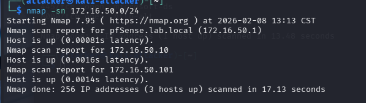
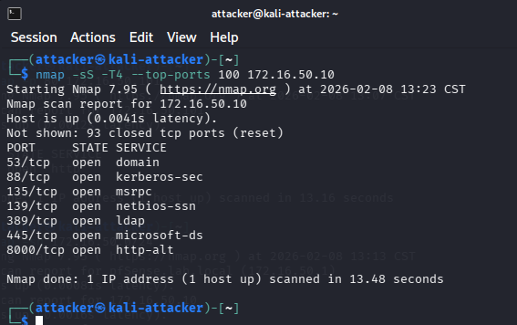
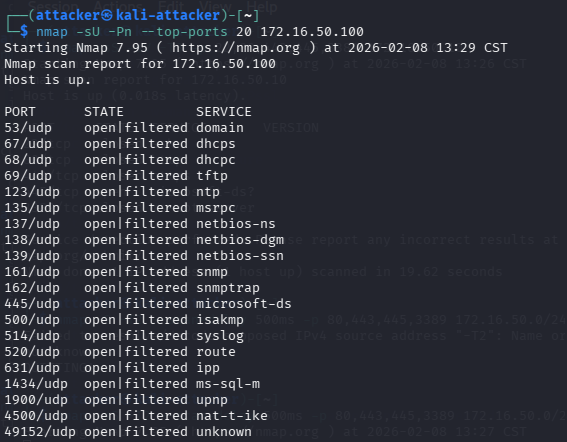
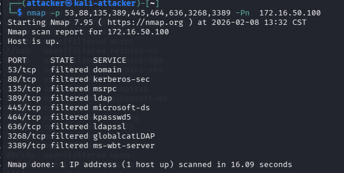
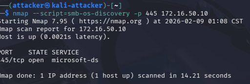

# Reconnaissance Phase – Network and Service Discovery

This section documents the reconnaissance phase from an attacker’s perspective. The goal of this phase is to understand the internal network layout, identify live systems, enumerate exposed services, classify machine roles, and select high-value targets for further attacks. This phase focuses only on information gathering and does not involve exploitation.

## Step 1: Host Discovery – Identifying Live Systems

Before attempting to attack any system, an attacker must first identify which IP addresses are alive on the network. This reduces noise and ensures that further reconnaissance is focused only on reachable hosts.

I began by performing host discovery across the internal subnet using multiple techniques to account for environments where ICMP may be blocked or filtered.

Host discovery was performed using the following commands:
```bash
nmap -sn 172.16.50.0/24  
nmap -Pn -sn 172.16.50.0/24  
```
Stealthy
```bash
map -sn -T1 --scan-delay 1s 172.16.50.0/24  
```

These scans revealed several active hosts within the internal network. At this stage, no assumptions were made about the role or importance of any system.



## Step 2: Port Scanning – Enumerating Exposed Services

After identifying live systems, the next step was to enumerate open ports on selected hosts. Port scanning helps an attacker understand which services are exposed and what type of attacks may be possible.

Rather than scanning the entire subnet aggressively, I performed targeted port scans against individual hosts.

Port scanning was performed using:
```bash
nmap -sS -T4 --top-ports 100 172.16.50.10  
nmap -sU -Pn --top-ports 20 172.16.50.101
```
Stealthy
```bash
nmap -sS -T1 --scan-delay 1s --top-ports 100 172.16.50.10  
```

The results showed commonly exposed service ports, indicating that this system was likely hosting a web application.





## Step 3: Identifying Machine Types Based on Protocols

Once port information was collected, I analyzed the exposed services to identify the role of each system. Different protocols reveal different machine types and priorities from an attacker’s perspective.

The following observations were used to classify systems:
- Ports 80 or 443 indicate a web server
- Port 445 suggests a Windows-based system
- Ports 88 and 389 indicate Active Directory services
- Multiple directory and authentication ports indicate a Domain Controller

Based on this analysis, one host was identified as a web application server, while another appeared to be an Active Directory Domain Controller.

## Step 4: Focused Reconnaissance of the Domain Controller

After identifying a potential Domain Controller, reconnaissance was narrowed to Active Directory–specific services. This confirms the system’s role while avoiding unnecessary scanning.

Focused scanning against common AD service ports was performed using:
```bash
nmap -p 53,88,389,445,464,636,3268 172.16.50.10 
```

The presence of multiple authentication and directory services confirmed this system as a Domain Controller and a high-value target.



## Step 5: Web Application Reconnaissance (DVWA)

After identifying a web server, reconnaissance shifted to the application layer. The goal of this step was to understand the technologies in use and enumerate accessible application paths.

### Step 5.1: Technology Identification

I performed technology fingerprinting against the web application to identify the underlying web stack.

Technology identification was performed using:
```bash
whatweb http://172.16.50.101  
```

This confirmed the presence of a deliberately vulnerable web application and provided insight into the technologies used.

### Step 5.2: Directory Enumeration

Next, I performed directory enumeration to identify hidden or unlinked application endpoints that could be targeted during exploitation.

Directory enumeration was performed using:
```bash
gobuster dir -u http://172.16.50.101 -w /usr/share/wordlists/dirb/common.txt
``` 
Stealthy
```bash
gobuster dir -u http://172.16.50.101 -w /usr/share/wordlists/dirb/common.txt -t 5 --delay 200ms  
```

This process revealed multiple application paths that were not immediately visible through normal browsing.


## Step 6: Active Directory Reconnaissance

With the Domain Controller identified, I performed additional reconnaissance to confirm SMB availability and gather operating system context.

SMB reconnaissance was performed using:
```bash
nmap --script smb-os-discovery -p 445 172.16.50.10
``` 

This provided useful information about the operating system and domain environment, which is critical for planning later Active Directory attacks.



## Reconnaissance Phase Summary

By the end of the reconnaissance phase, I was able to:
- Identify live hosts within the internal network
- Enumerate exposed ports and services
- Classify machine roles based on observed protocols
- Identify a web application server and an Active Directory Domain Controller
- Select high-value targets for further attacks

This phase relied primarily on ARP, ICMP, and allowed TCP probes, which generated limited actionable telemetry. This reflects a realistic scenario where early reconnaissance activity may not be reliably detected until attackers begin interacting with applications or authentication services.

## Next Step: Web Attacks

With the attack surface mapped and high-value targets identified, the next phase focuses on exploiting the web application. This phase generates richer application-level logs that can be analyzed and detected using Splunk.
