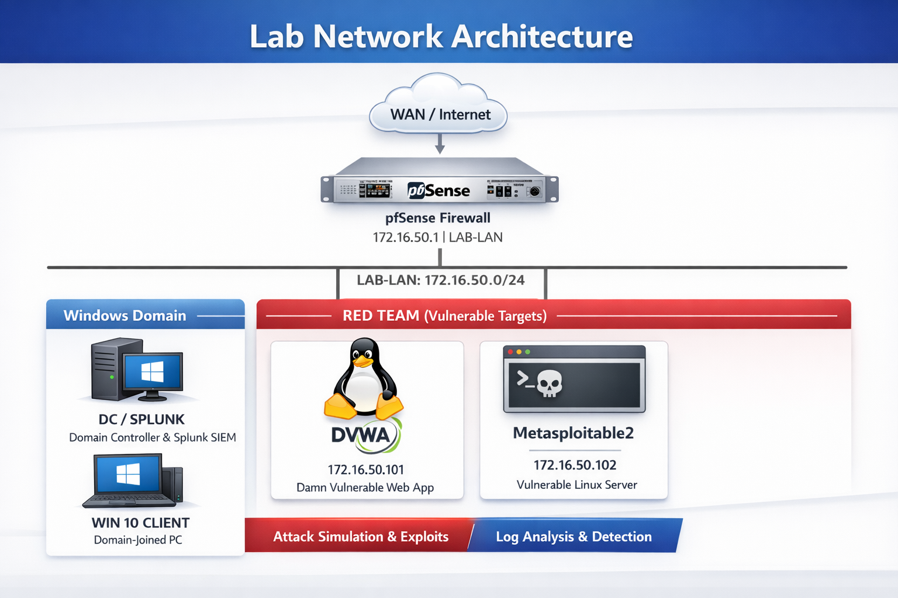

# Lab Architecture Overview

## Objective
The goal of this lab is to simulate realistic attack scenarios against intentionally vulnerable systems and analyze how those attacks appear in logs, with a focus on building detection logic using Splunk SIEM.

The environment is designed to support both:
- controlled attack simulation (red input)
- centralized log analysis and detection (blue analysis)

## High-Level Architecture
The lab consists of multiple virtual machines segmented behind a firewall to emulate an enterprise network.

Components:
- pfSense: Network gateway and firewall
- Windows Server: Active Directory Domain Controller and Splunk SIEM
- Windows 10: Domain-joined client
- Ubuntu Server: DVWA vulnerable web application
- Metasploitable2: Intentionally vulnerable host for network/service attacks

## Network Design
- Internal Network: LAB-LAN (172.16.50.0/24)
- pfSense LAN: 172.16.50.1
- DC01 / Splunk: 172.16.50.10
- Windows Client: DHCP
- DVWA (Ubuntu): 172.16.50.101
- Metasploitable: 172.16.50.102

All lab hosts communicate through pfSense, ensuring traffic can be observed and correlated across network, host, and application layers.

## Design Considerations
- Internal Network isolation prevents exposure to the host or external networks
- pfSense centralizes routing and firewall control
- Vulnerable systems are intentionally left insecure for detection purposes
- Splunk is used as a centralized analysis platform, not as a prevention control

## Scope
This lab is designed to simulate attacker methodology through controlled attack scenarios and to analyze the resulting logs in Splunk in order to understand and detect attack patterns from both red and blue team perspectives.
