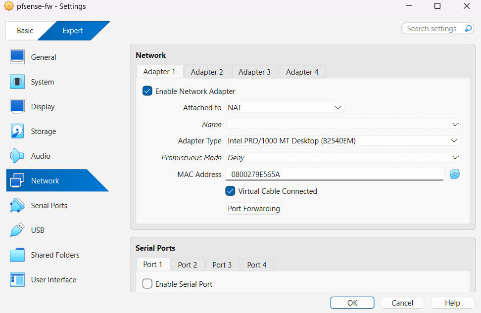
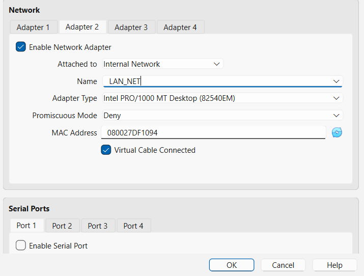

# Network Segmentation and pfSense Setup

This section documents how pfSense was set up as the central network component in the lab, including the reasoning behind each configuration step.

## Step 1: Deploy pfSense as the Network Gateway
pfSense was deployed as a dedicated virtual machine to act as the router and firewall for the lab environment. The goal was to introduce a realistic network boundary similar to what exists in enterprise environments, rather than allowing all virtual machines to communicate freely.

Using pfSense ensures that all traffic between systems passes through a central point where it can later be observed, controlled, and correlated with logs.

## Step 2: Configure WAN Interface
The WAN interface was connected to VirtualBox NAT. This was done to provide outbound internet access for the lab, allowing systems to download updates, packages, and software when required.

The WAN interface was left on DHCP to keep the configuration simple and avoid hardcoding external network settings.

## Step 3: Configure LAN Interface
The LAN interface was connected to a VirtualBox Internal Network named `LAB-LAN`. This internal network isolates the lab from the host machine and external networks while still allowing controlled communication between lab systems.

The LAN interface was assigned the static IP address `172.16.50.1/24`. This address serves as the default gateway for all internal hosts.

Using a dedicated internal subnet makes it easier to reason about traffic flow and clearly distinguish lab traffic from external traffic.

## Step 4: Enable DHCP on LAN
pfSense was configured as the DHCP server for the internal network. A DHCP range of `172.16.50.100` to `172.16.50.200` was defined to allow new lab systems to obtain network connectivity quickly.

DHCP was used for flexibility during early setup, while critical systems such as the Domain Controller and Splunk were later assigned static IP addresses to ensure consistency.

## Step 5: Connect Lab Systems to the Internal Network
All lab virtual machines (Windows Server, Windows client, Ubuntu DVWA, and Metasploitable) were connected to the same VirtualBox Internal Network (`LAB-LAN`).

This ensures that:
- All systems use pfSense as their default gateway
- Network traffic between systems can be observed centrally
- Attacks against vulnerable hosts generate network-level telemetry

## Step 6: Validate Network Connectivity
After configuring pfSense and connecting the lab systems, basic connectivity tests were performed:
- Internal hosts were able to ping the pfSense LAN address (`172.16.50.1`)
- Hosts were able to communicate with each other within the internal subnet

These checks confirmed that routing and basic network configuration were functioning as expected.

## Why This Setup Matters
This network design ensures that:
- The lab is isolated and safe
- Network traffic flows through a single control point
- Attacks performed later in the lab generate observable network activity
- Network events can be correlated with host and application logs in Splunk

This foundation enables meaningful attack simulation and detection analysis in later stages of the project.
