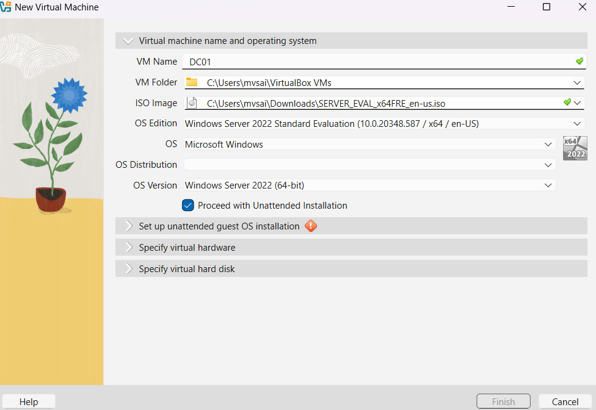
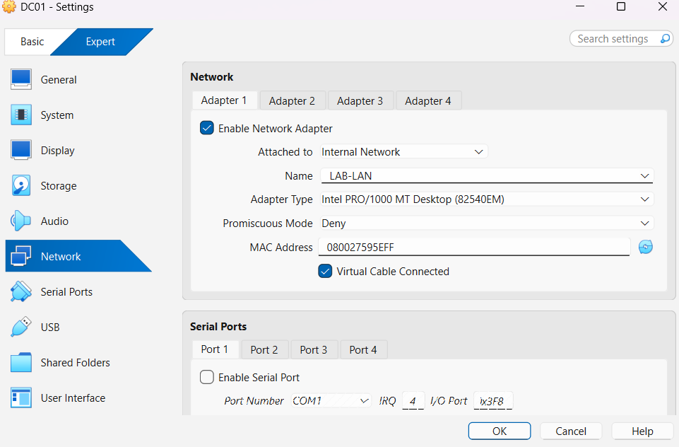
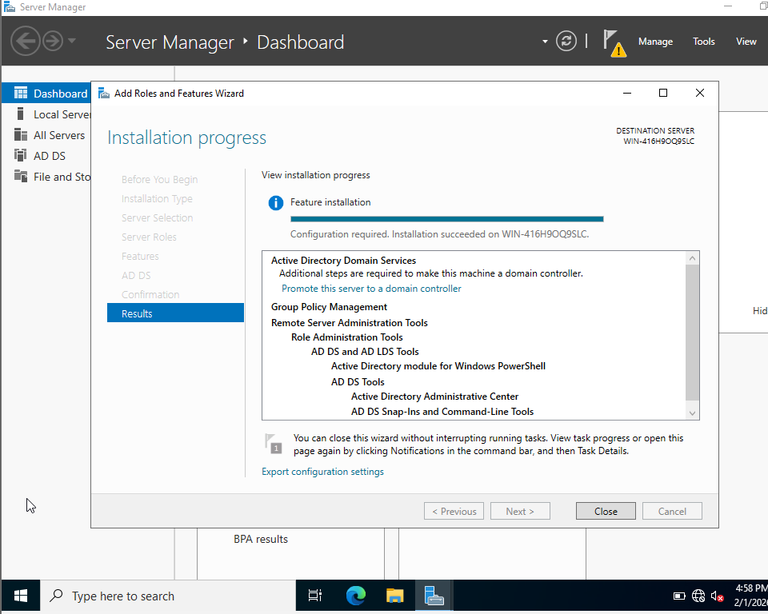
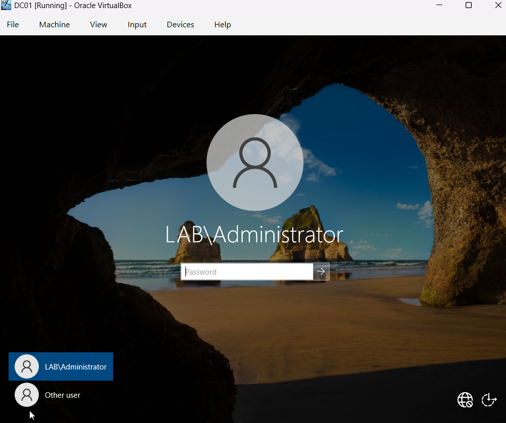
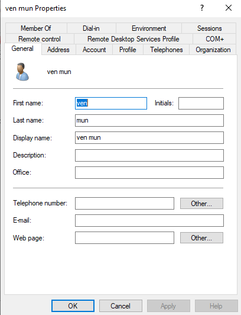

# Active Directory Domain Setup (Process Overview)

This section documents the complete process used to set up Active Directory in the lab, starting from downloading the Windows Server ISO to creating domain users. Active Directory is a core component of the lab because it provides centralized identity management and generates authentication and authorization logs that are later analyzed in Splunk.

## Step 1: Download Windows Server ISO
I first downloaded the Windows Server ISO from Microsoft’s official evaluation site. The evaluation version is sufficient for lab purposes and does not require a license during the evaluation period.

Using an official ISO ensures compatibility with Active Directory features and avoids unexpected limitations.

## Step 2: Create the Windows Server Virtual Machine
I created a new virtual machine in VirtualBox for the Domain Controller. During VM creation, I selected:
- Operating system: Windows Server
- Network adapter: Internal Network (`LAB-LAN`)
- Memory and storage appropriate for a server role

Connecting the VM to the internal network ensures it will communicate with other lab systems through pfSense.



## Step 3: Install Windows Server
After attaching the ISO, I installed Windows Server using the default installation options. Once installation completed, I logged in using the local administrator account created during setup.

At this stage, the system is a standalone Windows server with no domain services enabled.

## Step 4: Configure Network Settings
Before installing Active Directory, I configured the server’s network settings:
- Assigned a static IP address
- Set the DNS server to point to itself

This configuration is required because Active Directory depends on DNS for domain services, authentication, and service discovery.



## Step 5: Install Active Directory Domain Services (AD DS)
Using Server Manager, I installed the **Active Directory Domain Services (AD DS)** role. This role provides the components required to create and manage a Windows domain.

Installing AD DS prepares the server for domain functionality but does not yet create a domain.



## Step 6: Promote the Server to a Domain Controller
After AD DS installation, I promoted the server to a Domain Controller. During this process, I created a new forest and defined a new domain name.

A Directory Services Restore Mode (DSRM) password was also configured to support recovery operations if needed.

Once promotion completed, the server automatically rebooted.

## Step 7: Verify Domain Controller and Log in as Domain Admin
After reboot, the login screen showed the newly created domain. I logged in using the domain administrator account to confirm that the domain was successfully created and operational.

At this point, the server is functioning as the central authentication authority for the lab.



## Step 8: Create Domain User Accounts
With the domain operational, I created standard domain user accounts using Active Directory Users and Computers. These users represent normal enterprise users and will later be used to log in from domain-joined systems.

Creating non-administrative users allows realistic testing of authentication behavior, login failures, and user activity.



Example PowerShell command used to list domain users:

```powershell
Get-ADUser -Filter *

```

## Next Step: Domain-Joined Windows Client (WIN-01)

With Active Directory fully configured and domain users created, the next step is to deploy a Windows client machine (WIN-01). This system will be joined to the domain and used by the created user accounts to generate realistic workstation and authentication telemetry.
