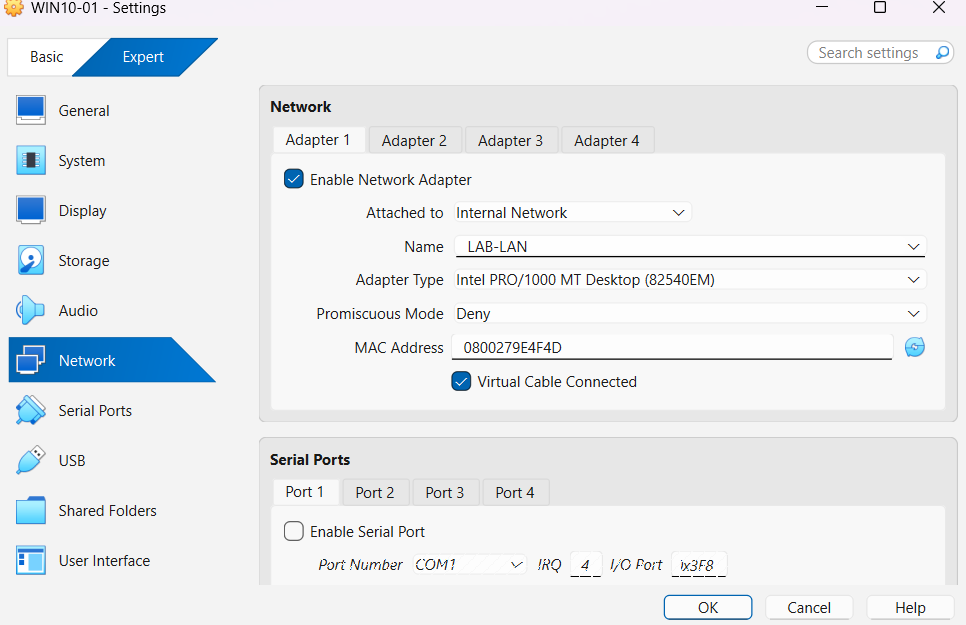
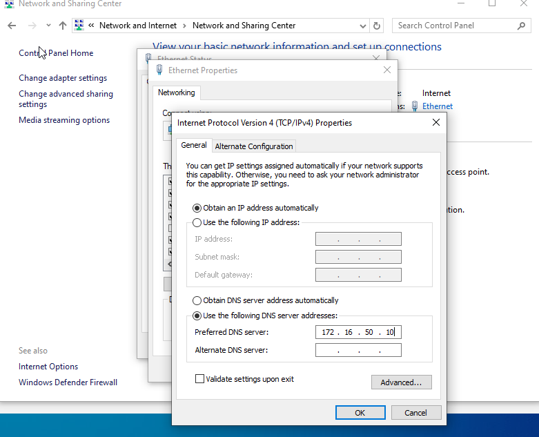
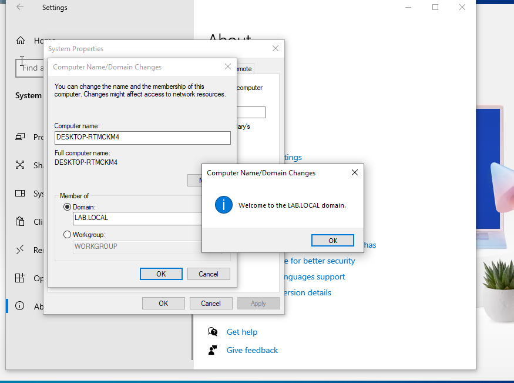

# Windows Client (WIN-01) Domain Join and User Login

This section documents how a Windows client machine (WIN-01) was deployed, joined to the Active Directory domain, and used to log in with a domain user account. This step is important because it generates realistic workstation and authentication activity that will later be analyzed in Splunk.

## Step 1: Create the Windows Client Virtual Machine
I created a new Windows 10 virtual machine in VirtualBox to act as a standard user workstation. The VM was connected to the same VirtualBox Internal Network (`LAB-LAN`) so that it could communicate with the Domain Controller through pfSense.

Connecting the client to the internal network ensures that all authentication traffic flows through the lab environment.

## Step 2: Configure Network Settings
After installing Windows, I verified the network configuration on WIN-01. The system received an IP address from pfSense via DHCP and was using the Domain Controller as its DNS server.

Correct DNS configuration is critical, as Active Directory relies on DNS to locate domain services.




## Step 3: Join WIN-01 to the Domain
With networking and DNS verified, I joined the Windows client to the Active Directory domain. During this process, I provided domain administrator credentials to authorize the domain join.

After the domain join completed successfully, the system was rebooted to apply the changes.



## Step 4: Log In Using a Domain User Account
Once the system rebooted, I logged in to WIN-01 using the non-administrative domain user account that was previously created in Active Directory.

This confirms that the domain join was successful and that the user account can authenticate from a workstation.

## Step 5: Verify Domain User Context
After logging in, I verified the current user context using the `whoami` command. The output confirmed that the logged-in user belongs to the Active Directory domain rather than a local account.

```powershell
whoami
```

## Next Step: Splunk Integration

With WIN-01 successfully joined to the domain and domain users able to log in, the next step is to integrate Splunk. This includes forwarding Windows event logs from both the Domain Controller and WIN-01 to Splunk for centralized analysis and detection.