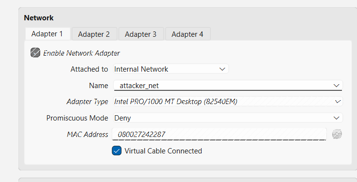
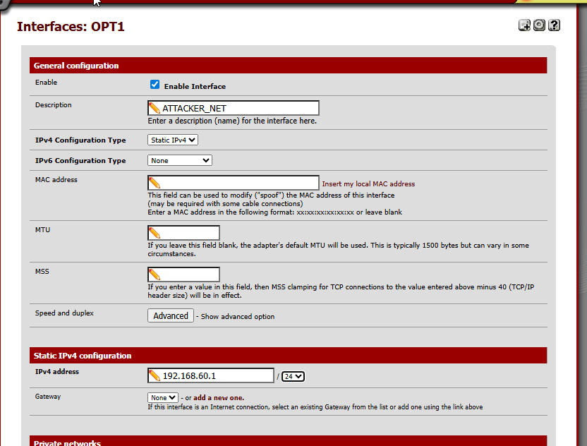
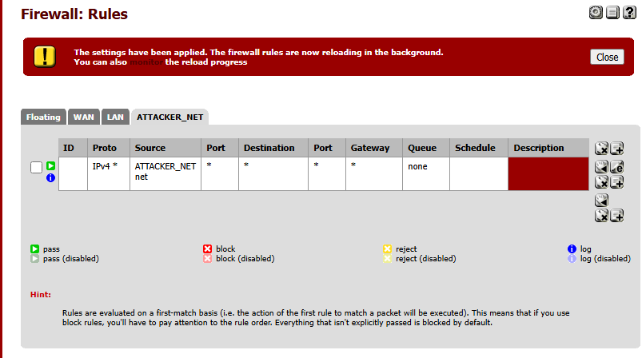
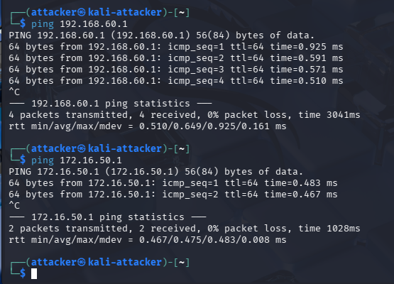

# Attacker Machine Setup (Isolated Network)

## Why I Did This

To simulate a real-world attacker and ensure all attack traffic is visible, I deployed a **dedicated Kali Linux attacker VM** on a **separate network**.  
This forces all reconnaissance and attack traffic to pass through **pfSense**, allowing proper logging and detection.

---

## Network Design

I divided the lab into two networks:

- **Attacker Network**
  - Subnet: `192.168.60.0/24`
  - Host: Kali Linux
  - Gateway: `192.168.60.1` (pfSense)

- **Internal Lab Network**
  - Subnet: `172.16.50.0/24`
  - Hosts: DVWA, Metasploitable, AD, Splunk
  - Gateway: `172.16.50.1` (pfSense)


---

## Kali Network Configuration

I configured the Kali VM to use an **Internal Network** so it cannot directly communicate with internal hosts.

**VirtualBox Path:**  
`Kali VM → Settings → Network`

- Adapter: Internal Network  
- Name: `attacker_net`  



---

## pfSense Interface Configuration

I added a dedicated interface for the attacker network in pfSense.

**Path:**  
`pfSense → Interfaces → Assignments → OPT1`

- Interface name: `ATTACKER_NET`
- IPv4: Static
- IP address: `192.168.60.1/24`
- Block private networks: Disabled

📸 *Screenshot:* `images/pfsense-attacker-interface.png`


---

## DHCP for Attacker Network

pfSense provides DHCP to the attacker subnet.

**Path:**  
`pfSense → Services → DHCP Server → ATTACKER_NET`

- DHCP range: `192.168.60.50 – 192.168.60.100`

---

## Firewall Rule for Attacker Traffic

To allow and log attacker activity, I created a firewall rule on the attacker interface.

**Path:**  
`pfSense → Firewall → Rules → ATTACKER_NET`

- Action: Pass  
- Source: ATTACKER_NET subnet  
- Destination: Any  
- Logging: Enabled  



---

## Connectivity Verification

From Kali, I verified connectivity to internal hosts:

```bash
ping 172.16.50.1
ping 172.16.50.10
```
Successful responses confirmed that traffic is routed through pfSense.



## Result

The attacker machine is fully isolated and all traffic is forced through pfSense.
This setup provides realistic attacker simulation and reliable telemetry for detection and analysis in Splunk.