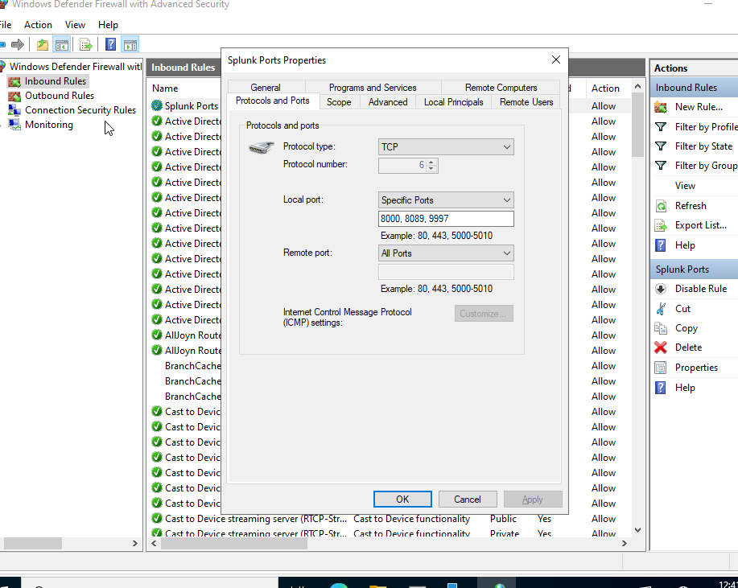
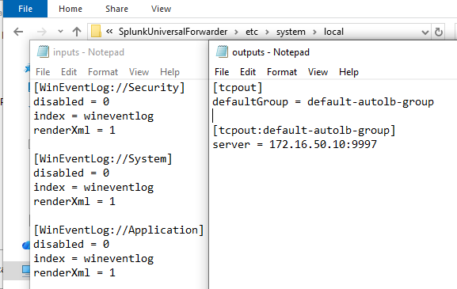
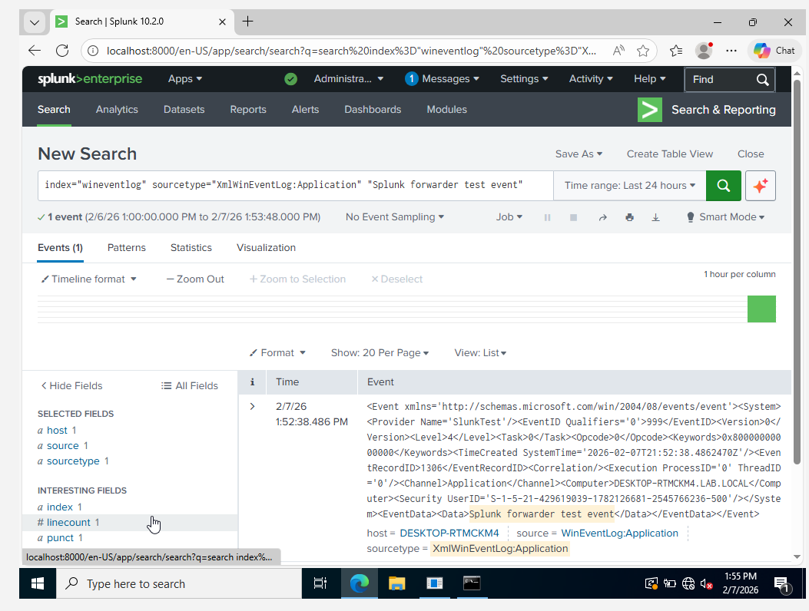

# Splunk Universal Forwarder on Windows 10 

This section describes how I configured the Splunk Universal Forwarder on a Windows 10 system. The goal was to collect Windows Event Logs from the endpoint and forward them to the central Splunk Enterprise instance running on the Domain Controller.

---

## Step 1: Install the Splunk Universal Forwarder
I installed the Splunk Universal Forwarder on the Windows 10 machine to act as the log collection agent. Instead of installing the full Splunk Enterprise package, I used the Universal Forwarder because it is lightweight and purpose-built for securely forwarding logs.

During installation, I selected the option to connect to an on-premises Splunk Enterprise instance and configured the receiver address as the Domain Controller on port `9997`. The service was configured to run as the Local System account to ensure it had sufficient privileges to read Windows Security Event Logs.


---

## Step 2: Allow Splunk Traffic Through the Firewall
After installing the forwarder, I ensured that the Domain Controller firewall allowed inbound Splunk traffic. Since the forwarder communicates with the indexer over TCP, the receiving port needed to be explicitly permitted.

I created an inbound firewall rule allowing TCP port `9997`, along with ports `8000` and `8089` for Splunk Web and management access. This step was critical to allow the forwarder to establish a persistent connection with the indexer.



---

## Step 3: Configure Windows Event Log Inputs
Next, I configured the forwarder to collect Windows Event Logs by creating an `inputs.conf` file. This file defines which logs should be monitored and where they should be indexed in Splunk.

I enabled collection for the Security, System, and Application event logs and configured them to be sent to the `wineventlog` index. XML rendering was enabled to preserve full event detail for later analysis.

---

## Step 4: Configure Forwarder Output Destination
To ensure collected logs were sent to the correct destination, I configured the forwarder output using `outputs.conf`. This configuration specifies the Splunk indexer and port that will receive the forwarded data.

By explicitly defining the Domain Controller IP and port `9997`, I ensured that all collected Windows logs were forwarded using Splunk’s native forwarding protocol.



---

## Step 5: Restart the Forwarder Service
After configuring the input and output settings, I restarted the forwarder service to force it to reload the new configuration files. Restarting ensured that the forwarder began actively collecting and forwarding logs.

```cmd
taskkill /F /IM splunkd.exe
"C:\Program Files\SplunkUniversalForwarder\bin\splunk.exe" start
```

## Step 6: Validate Log Ingestion with a Test Event

To confirm end-to-end log flow, I generated a test Windows event using the eventcreate command. This allowed me to validate that events generated on Windows 10 were successfully ingested by Splunk.

```cmd
eventcreate /ID 999 /L APPLICATION /T INFORMATION /SO SplunkTest /D "Splunk forwarder test event"
```

## Verify the Event in Splunk

Finally, I searched for the test event in Splunk using the wineventlog index. The event appeared successfully with full XML data, confirming that the forwarder was functioning as expected.



## Result

At this point, the Windows 10 Splunk Universal Forwarder was fully operational. Windows Event Logs were being collected, forwarded, and indexed successfully, providing host-level telemetry for later detection and analysis.

Any issues encountered during this process and how they were resolved are documented in the troubleshooting section.