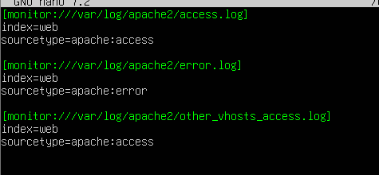
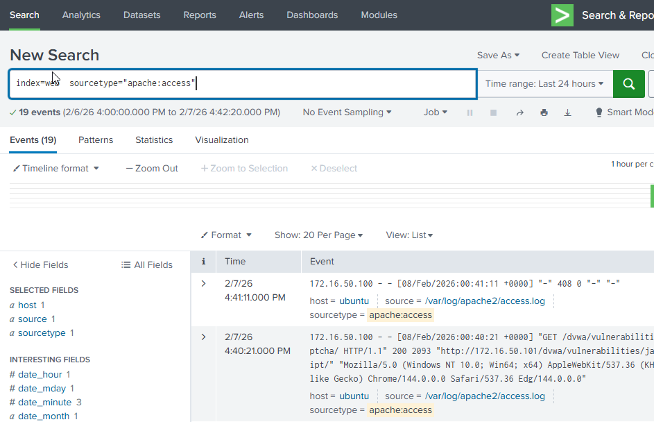

# DVWA Apache Log Ingestion

This section describes how I configured the Splunk Universal Forwarder on the DVWA (Ubuntu) host to collect Apache web server logs and forward them to the central Splunk Enterprise instance. The objective was to capture web application–level telemetry generated by user interactions and attacks against DVWA.

---

## Step 1: Identify Relevant Apache Log Files
Since DVWA runs on Apache, I first identified the log files that capture HTTP activity and server-side issues. On the DVWA host, Apache writes request-level data to `access.log` and application or server-related messages to `error.log`.

These logs provide visibility into:
- Client requests and responses
- Request paths and parameters
- Server-side warnings and errors triggered during application interaction

This makes them critical for analyzing web-based attacks later in the lab.

---

## Step 2: Install and Start the Splunk Universal Forwarder
I installed the Splunk Universal Forwarder on the DVWA host to act as the log collection agent. The forwarder was installed using the Debian package and configured to run as a service so it could continuously monitor log files.

After installation, I started the forwarder and accepted the license to initialize the service.

---

## Step 3: Configure Apache Log Monitoring
To enable log collection, I configured the forwarder inputs to monitor Apache log files. An `inputs.conf` file was created to define which files should be watched and how the data should be indexed in Splunk.

The Apache access and error logs were configured to be sent to a dedicated `web` index with appropriate sourcetypes. This separation allows web application logs to be analyzed independently from host and network telemetry.

---

## Step 4: Restart the Forwarder to Apply Configuration
After defining the input configuration, I restarted the Splunk Universal Forwarder to ensure the new settings were loaded. Restarting the forwarder forces it to re-read configuration files and begin actively monitoring the specified log paths.

This step was necessary for the forwarder to start sending Apache logs to Splunk.

---

## Step 5: Generate Web Application Traffic
To validate log ingestion, I accessed DVWA through a web browser and performed several actions such as logging in and navigating different pages. These actions generated HTTP requests and responses, which were written to the Apache access and error logs.

Generating live traffic ensured that new log entries were created and forwarded in real time.

---

## Step 6: Verify Apache Logs in Splunk
Finally, I verified that the Apache logs were successfully ingested into Splunk by searching the `web` index. Both access and error logs appeared as expected, confirming that the forwarder was correctly monitoring and forwarding Apache telemetry.

This validated the end-to-end flow from DVWA → Splunk Universal Forwarder → Splunk Enterprise.

---

## Result
At this stage, Apache access and error logs from the DVWA host were successfully ingested into Splunk. This completed web application–level logging for the lab and provided the necessary telemetry to analyze web attacks, user behavior, and server-side errors during later attack simulations.

With endpoint, directory service, and web application logs now available, the lab is prepared for correlation and detection development.
