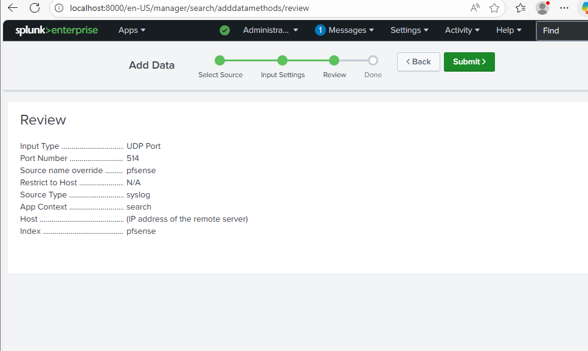
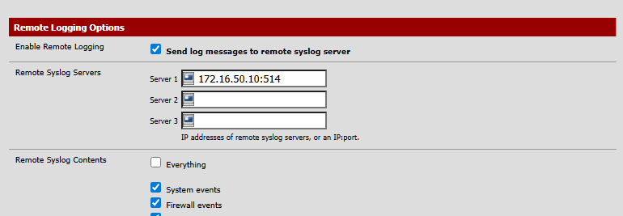
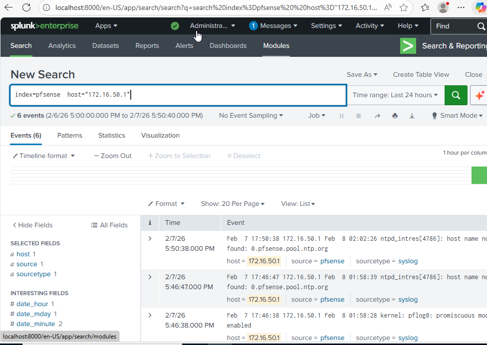

# pfSense Firewall and System Log Ingestion

This section describes how I configured pfSense to forward firewall and system logs to Splunk. The goal was to capture network-level telemetry generated by traffic flowing between lab systems and centralize it for analysis and correlation with host and application logs.

---

## Step 1: Enable Syslog Receiving in Splunk
Before configuring pfSense, I prepared Splunk to receive network logs by enabling a UDP syslog input. pfSense natively exports logs using the syslog protocol, so Splunk was configured to listen on UDP port `514`.

A dedicated index named `pfsense` was used to store all firewall and system logs. This separation ensures that network telemetry remains distinct from Windows and web application logs, making analysis and detection easier later in the lab.

---

## Step 2: Allow Syslog Traffic Through the Domain Controller Firewall
Since Splunk is hosted on the Domain Controller, I configured a Windows Firewall inbound rule to allow UDP traffic on port `514`. Without this rule, pfSense syslog messages would be silently dropped.

Allowing this port ensured that pfSense could reliably transmit logs to Splunk over the internal lab network.

---

## Step 3: Configure Remote Logging on pfSense
With Splunk ready to receive logs, I configured pfSense to forward logs to the Splunk server.

In the pfSense web interface, remote logging was enabled and the Splunk server IP and port were specified as the syslog destination. I selected firewall and system logs to ensure visibility into both traffic decisions and internal pfSense events.

This configuration causes pfSense to stream log events in real time whenever traffic flows through the firewall.

---

## Step 4: Generate Network Traffic
To validate log forwarding, I generated traffic across the lab environment by accessing internal systems and initiating network connections between virtual machines.

Because pfSense sits at the center of the network, all traffic passed through the firewall, producing immediate log entries.

---

## Step 5: Verify pfSense Logs in Splunk
After generating traffic, I verified that logs were successfully ingested into Splunk by searching the `pfsense` index. Firewall events and system messages appeared as expected, confirming end-to-end log flow from pfSense to Splunk.

These logs provide visibility into allowed and blocked connections, source and destination IPs, ports, and protocols, which are critical for network-level detection and analysis.

---

## Result
At this stage, pfSense firewall and system logs were successfully ingested into Splunk. This completed network-level logging for the lab and enabled full visibility across endpoints, directory services, web applications, and network infrastructure.

With pfSense logs available, the lab now supports realistic attack simulations and correlation across host, application, and network telemetry.
