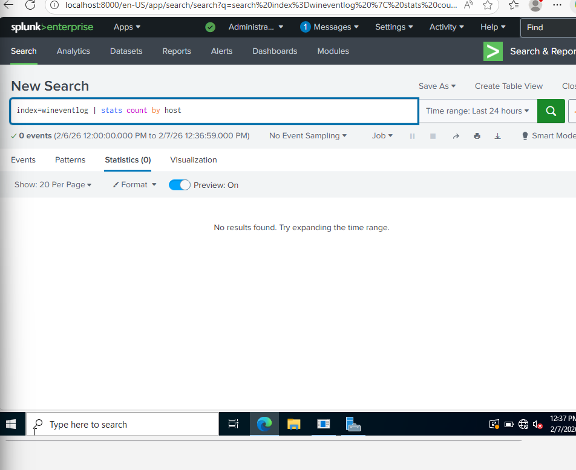
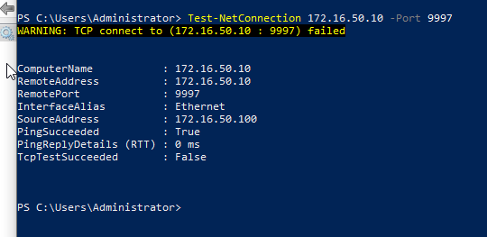
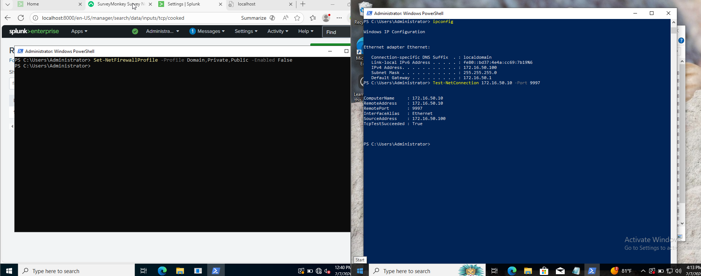
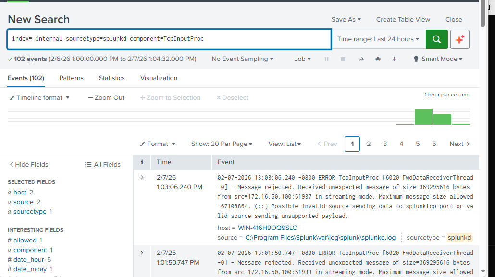

# Splunk Forwarder Troubleshooting 

This section documents the issues encountered while configuring the Splunk Universal Forwarder on different machines and explains how each issue was identified and resolved.

---
# Windows 10

## Issue 1: No Events Appearing in Splunk

### What I Observed
After completing the initial forwarder configuration, no events appeared in Splunk when searching the `wineventlog` index. This indicated that logs were either not being forwarded or not reaching the indexer.


---

### What I Checked
I began by validating the forwarder configuration files and verifying that the correct index and receiver were configured. I then tested network connectivity between the Windows 10 system and the Domain Controller.

At this stage, I discovered that a TCP connection to the indexer on port `9997` was not being established.



---

### Root Cause
The Domain Controller firewall was blocking inbound traffic on the Splunk receiving port, preventing the forwarder from establishing a connection.

---

### Resolution
I updated the inbound firewall rules on the Domain Controller to allow TCP traffic on port `9997`. After applying the rule, the TCP connection was successfully established.



---

## Issue 2: Data Rejected by the Splunk Receiver

### What I Observed
After resolving the firewall issue, the forwarder was able to connect, but Splunk logged repeated errors indicating that messages were being rejected due to unsupported payloads.

These errors appeared in the `_internal` logs under the `TcpInputProc` component.



---

### Root Cause
The forwarder was incorrectly configured to treat the indexer as a deployment server. A `deploymentclient.conf` file was present and pointed to the indexer on port `9997`.

Since port `9997` is strictly a data receiving port and not a deployment server endpoint, this caused Splunk to reject incoming data.

---

### Resolution
I removed the `deploymentclient.conf` file from the forwarder configuration directory and restarted the forwarder. This allowed the forwarder to correctly load local input configurations and send valid Splunk protocol data.

---

## Issue 3: Forwarder Running but No Inputs Active

### What I Observed
Even after resolving the receiver errors, the forwarder initially showed no active inputs. Commands such as `splunk list inputstatus` returned no WinEventLog entries.

---

### Root Cause
The presence of the deployment client configuration prevented the forwarder from loading the locally defined `inputs.conf` file.

---

### Resolution
After removing the deployment client configuration, I verified that inputs were correctly loaded using the `btool` utility. The output confirmed that all WinEventLog inputs were active.

```cmd
splunk btool inputs list --debug
```
## Final Outcome

After resolving firewall connectivity issues, removing the invalid deployment configuration, and confirming active inputs, the forwarder began ingesting Windows Event Logs successfully.